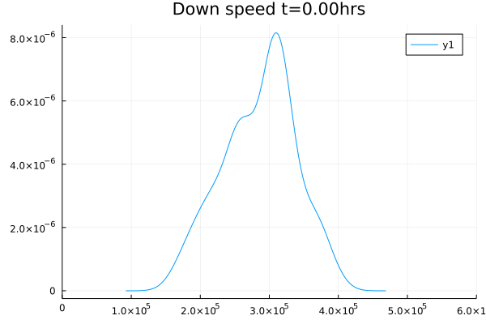
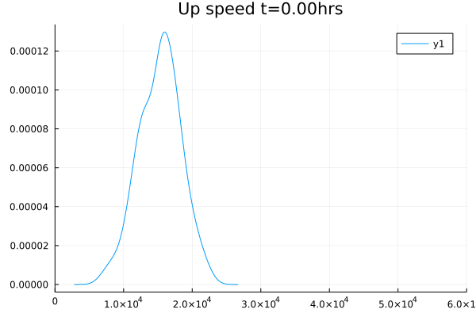
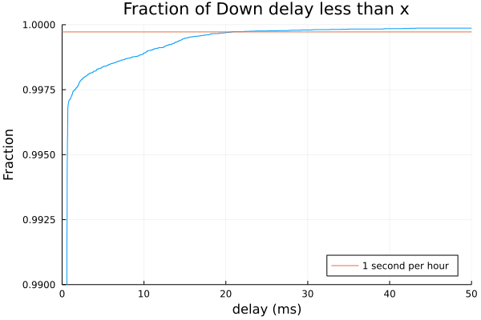
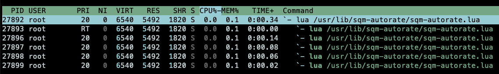

# CAKE with Adaptive Bandwidth - "sqm-autorate"

## About _sqm-autorate_
_sqm-autorate_ is a program for [OpenWRT](https://openwrt.org/) that actively manages the
[CAKE Smart Queue Management (SQM)](https://www.bufferbloat.net/projects/codel/wiki/Cake/) bandwidth settings through measurments of traffic load and latency. It is designed for variable bandwidth connections such as DOCIS/cable and LTE/wireless,
and is not so useful for connections that have a stable, fixed bandwidth.

The _sqm-autorate_ code is licensed under the [MPLv2](https://www.mozilla.org/en-US/MPL/2.0/)

_sqm-autorate_ is undergoing rapid development, so sometimes the documentation lags behind the latest and greatest.
We do try to keep up and occasionally succeed!

## Table of Contents
* [About _sqm-autorate_](#about-sqm-autorate)
* [Table of Contents](#table-of-contents)
* [Introduction](#introduction)
  * [Use cases of _sqm-autorate_](#use-cases-of-sqm-autorate)
  * [What is the problem that _sqm-autorate_ solves?](#what-is-the-problem-that-sqm-autorate-solves)
  * [What does _sqm-autorate_ do?](#what-does-sqm-autorate-do)
  * [What happens when _sqm-autorate_ is running?](#what-happens-when-sqm-autorate-is-running)
  * [How to see what _sqm-autorate_ is doing?](#how-to-see-what-sqm-autorate-is-doing)
* [Request to testers](#request-to-testers)
* [Installation](#installation)
* [Configuration](#configuration)
  * [Verbosity Options](#verbosity-options)
* [Graphical Analysis](#graphical-analysis)
  * [Julia installation and first time use](#julia-installation-and-first-time-use)
  * [Running plotstats.jl](#running-plotstatsjl)
  * [timeseries.png](#timeseriespng)
  * [delayupecdf.png and delaydownecdf.png](#delayupecdfpng-and-delaydownecdfpng)
  * [uphist.gif and downhist.gif](#uphistgif-and-downhistgif)
  * [zoomedts.png](#zoomedtspng)
* [Troubleshooting](#troubleshooting)
  * [Error Reporting Script](#error-reporting-script)
* [Manual Execution](#manual-execution)
* [Upgrading](#upgrading)
* [Removal](#removal)
* [Development](#development)
  * [sqm-autorate.lua](#sqm-autoratelua)
  * [Lua Threads Algorithm](#lua-threads-algorithm)
  * [Algorithm In Action](#algorithm-in-action)
* [Output and Monitoring](#output-and-monitoring)
  * [View of Processes](#view-of-processes)
  * [Log Output](#log-output)

## Introduction

### Use cases of _sqm-autorate_
The primary use of _sqm-autorate_ is for managing the network speed and latency for DOCIS/cable and LTE/wireless connections
under the CAKE SQM on OpenWRT routers so that users get an actively managed best compromise between network latency and network speed.

There is a secondary use case on OpenWRT routers using CAKE.
It provides some analytical tools that produce graphs that can help understand the performance characterictics of an ISP connection, even when it is very stable.

In the longer term, the dev team hope to conquer the world but will settle for the the occasional feeling of self-satisfaction.

### What is the problem that _sqm-autorate_ solves?
CAKE is an algorithm that manages the buffering of data
being sent/received by an OpenWrt router so that no more
data is queued than is necessary,
minimizing the latency ("bufferbloat")
and improving the responsiveness of a network.

CAKE is great!

However out of the box, CAKE makes the assumption that an ISP connection has a stable speed (bandwidth) and a stable latency.
This is **not** the case for connections on **DOCIS/cable**, or on **LTE/wireless technologies**.
The achieveable speed and latency on these connections is sensitive to the number of simultaneous active connections (users, from the ISP point of view)
and, for wireless, may be sensitive to weather conditions.

To make CAKE work well, there is a compromise and trade off between speed and latency.
If there is need for fairly constant latency, then speed must be given up.
If there is a need for higher speed, then latency must be given up.
The compromise in CAKE is measured by the chosen bandwidth or speed.
And once a choice is made, it is awkward to adjust in CAKE.

Remember that while network speed is nice, beyond a necessary base speed, latency is what makes a network good for gaming, streaming, video calls, and general use.
And this is multiplied when several people share a common router.
Particularly if, for example, one is torrenting large files, while another is gaming, and another is in that career changing conference call.


Image credit [Lynxthecat](https://github.com/lynxthecat)

### What does _sqm-autorate_ do?

#### In consise terms:

_sqm-autorate_ monitors the current latency and current demand for bandwidth as seen on the router,
then frequently adjusts the CAKE speed to get the best current compromise.
And it does so independently for both uploads and downloads.

#### In more and still incomplete detail:

_sqm-autorate_ measures the [Round Trip Time (RTT)](https://en.wikipedia.org/wiki/Round-trip_delay)
to a number of [ICMP reflectors](https://en.wikipedia.org/wiki/Internet_Control_Message_Protocol)
and splits these into the upload and download components.
It uses some [cool maths](https://en.wikipedia.org/wiki/Moving_average#Exponential_moving_average)
to measure and keep a longer term _baseline_ latency and a fast moving _recent_ latency.
* If the recent latency is higher than the baseline, then the difference is the _delay_.
* If the recent latency is lower than the baseline, then the baseline is reset to to the recent,
because there is no such thing as negative delay on a network.

If there is high bandwidth utilisation (aka. load), with low delay, then the CAKE speed is adjusted up.
If there is a high delay, then the CAKE speed is adjusted down.
And all this is done separately for upload and download speeds, twice each second (by default).

There's much more going on, please ask in the [discussions](https://github.com/sqm-autorate/sqm-autorate/discussions),
though we suggest to first have a look at the rest of this document and then at the code.

### What happens when _sqm-autorate_ is running?
_sqm-autorate_ starts out with the CAKE speeds set to a chosen minimum acceptable speed.

When network activity occurrs that uses 80% or more of the current speed and the _delay_ is less than 15 millisconds (ms), then the speed is increased.
At lower speeds, the increase can be quite large.
As the speeds get towards the chosen target speed, the size of the increase is reduced.
_sqm-autorate_ will set the speed to rates higher than the chosen target if it does not see any delay.
It can even set the speeds higher than the maximum the connection is physically capable of.
But not to worry, there are compensating controls.

If the _delay_ exceeds 15 ms, then the speed is reduced.
If the delay is high at the same time as the utilisation (aka load) is low, then the speed is immediately reduced to the chosen minimum acceptable.

Many of the numbers mentioned above can be changed in the advanced settings, with technical details and some guidelines provided later in this document.

After a while, _sqm-autorate_ builds a profile of good speeds to use and the speed finding should stabilise.
On very variable connections, this algorithmic stabilisation should complete within 30-90 minutes.
During this stabilisation period, there may be some latency spikes but thereafter it should run smooth.
On very stable connections, the algorithmic stabilisation might never complete, because that stabilisation is not needed.

### How to see what _sqm-autorate_ is doing?
The shell command to use on the router to see the current CAKE bandwidth setting is `tc qdisc`.
Reading the output of this may initially be quite difficult, but is instant.

For [graphical analysis](#graphical-analysis) of results, _sqm-autorate_ provides a number of scripts written in [Julia](https://julialang.org/). See [Graphical Analysis](#graphical-analysis)

## Request to Testers

Please post your overall experience on this
[OpenWrt Forum thread.](https://forum.openwrt.org/t/cake-w-adaptive-bandwidth/108848/312)
Your feedback will help improve the script for the benefit of others.

Bug reports and/or feature requests [should be added on Github](https://github.com/sqm-autorate/sqm-autorate/issues/new/choose)
to allow for proper prioritization and tracking.

_For Testers, Jan 2022:_ For those people running OpenWrt snapshot builds,
a patch is required for Lua Lanes.
Details can be found here:
[https://github.com/sqm-autorate/sqm-autorate/issues/32#issuecomment-1002584519](https://github.com/sqm-autorate/sqm-autorate/issues/32#issuecomment-1002584519)

## Installation

1. Install the **SQM QoS** package (from the LuCI web GUI) or `opkg install sqm-scripts` from the command line

2. Configure [SQM for your WAN link,](https://openwrt.org/docs/guide-user/network/traffic-shaping/sqm) setting its interface, download and upload speeds, and
checking the **Enable** box.
In the **Queue Discipline** tab, select _cake_ and _piece\_of\_cake.qos._
If you have some kind of DSL connection, read the
**Link Layer Adaptation** section of the
[SQM HOWTO.](https://openwrt.org/docs/guide-user/network/traffic-shaping/sqm).
   Check the output of the shell command `tc qdisc | grep cake`.
   If the output of this command is empty, then CAKE is not yet setup.

3. Run the following command to run the setup script that downloads and installed the required files and packages:
   ```bash
   sh -c "$(wget -q -O- https://raw.githubusercontent.com/sqm-autorate/sqm-autorate/testing/lua-threads/sqm-autorate-setup.sh)"
   ```

4. If the setup script gives a warning about a configuration file `sqm-autorate-NEW`, use that file to replace `/etc/config/sqm-autorate` (first time installation only)

5. When the setup script completes, edit the config file `/etc/config/sqm-autorate` to set:
   * `upload_interface` to the name of your WAN interface, usually something like `wan` or `eth0`.
     The output of the shell command `tc qdisc | grep cake` should show the two interface names.
   * `download_interface` to the name of the associated download interface, usually like `ifb4eth0` or `veth`
   * `upload_base_kbits` to the expected upload speed that your connection provides on a good day.
   * `download_base_kbits` to the expected download speed

   You may want to adjust the minimum rates, which are controlled by:
   * `upload_min_percent` the percentage of your `upload_base_kbits` that is the minimum bandwidth that you can accept when there is high bufferbloat. This is defaulted to 20 (%) and can be between 10 and 60
   * `download_min_percent` as above but for 'download_base_kbits'

   If you want the value in `upload_base_kbits` or `download_base_kbits` to be 30 megabits/second, enter `30000`.

   The base values of `upload_base_kbits` and `download_base_kbits` should usually be close to or a little lower than the nominal or maximum rate that your ISP provides in their sales literature.
The base values that you provide are not hard maximums, _sqm-autorate_ will increase the rate above this whenever it calculates that it is possible.

   Note too that the script uses the "acceptable" rates calculated using `upload_min_percent` and `download_min_percent` as the lowest setting speed setting it will use to control latency.
In certain situations, the script may transition abruptly to either of these lower limits.
Set these values high enough to avoid cutting off your communications entirely.
The default is 20% of the base rates.
This is good for mid-range to high-speed connections (above 20 Mbps).
For very slow connections (below 5Mbps) perhaps use 50% of the nominal rate.
For connections below 3Mbps be aware that even one packet will take about 4ms at 3Mbps and 12ms at 1Mbps.
There is no way to get reliable low latency such as for gaming when your connection is much lower than 3Mbps.

6. Run these commands to start and enable the _sqm-autorate_ service that runs continually:
   ```
   service sqm-autorate enable && service sqm-autorate start
   ```

   If you do not want _sqm_autorate_ to run automatically at next boot, leave out the `service sqm-autorate enable`.

   If you want to run the program manually, leave out the `service sqm-autorate start`.

_For Testers, Jan 2022:_ For those people running OpenWrt snapshot builds,
a patch is required for Lua Lanes.
Details can be found here:
[https://github.com/sqm-autorate/sqm-autorate/issues/32#issuecomment-1002584519](https://github.com/sqm-autorate/sqm-autorate/issues/32#issuecomment-1002584519)

## Configuration

Generally, configuration should be performed via the `/etc/config/sqm-autorate` file.

| Section | Option Name | Value Description | Default |
| - | - | - | - |
| network | upload_interface | The upload interface name which is typically the physical device name of the WAN-facing interface. | 'wan' |
| network | download_interface | The download interface name which is typically created as a virtual interface when CAKE is active. This typically begins with 'ifb4' or 'veth'. | 'ifb4wan' |
| network | upload_base_kbits | The highest speed in kbit/s at which bufferbloat typically is non-existent for outbound traffic on the given connection. This is used for reference in determining safe speeds via learning, but is not a hard floor or ceiling. | '10000' |
| network | download_base_kbits | The highest speed in kbit/s at which bufferbloat typically is non-existent for inbound traffic on the given connection. This is used for reference in determining safe speeds via learning, but is not a hard floor or ceiling. | '10000' |
| network | upload_min_percent | The absolute minimum acceptable outbound speed as a percentage of `upload_base_kbits` that the autorate algorithm is allowed to fall back to in cases of extreme congestion, at the expense of allowing latency to exceed `upload_delay_ms`. | '20' |
| network | download_min_percent | The absolute minimum acceptable inbound speed as a percentage of `download_base_kbits` that the autorate algorithm is allowed to fall back to in cases of extreme congestion, at the expense of allowing latency to exceed `download_delay_ms`. | '20' |
| output | log_level | Used to set the highest level of logging verbosity. e.g. setting to 'INFO' will output all log levels at the set level or lower (in terms of verbosity). [Verbosity Options](#verbosity-options) | 'INFO' |
| output | stats_file | The location to which the autorate OWD reflector stats will be written. | '/tmp/sqm-autorate.csv' |
| output | speed_hist_file | The location to which autorate speed adjustment history will be written. | '/tmp/sqm-speedhist.csv' |
| advanced_settings | speed_hist_size | The amount of "safe" speed history which the algorithm will maintain for reference during times of increased latency/congestion. Set too high, the algorithm will take days or weeks to stabilise. Set too low, the algorithm may not have enough good values to stabilise on.  | '100' |
| advanced_settings | upload_delay_ms | The amount of delay that indicates bufferbloat for uploads. For high speed and relatively stable fiber connections, this can be reduced as low as 2. For LTE and DOCIS/cable connections, the default should be a reasonable starting point and may be increased. | '15' |
| advanced_settings | download_delay_ms | As upload_delay_trigger but for downloads. | '15' |
| advanced_settings | high_load_level | The load factor used to signal high network load. Between 0.67 and 0.95. | '0.8' |
| advanced_settings | reflector_type | This is intended for future use and details are TBD. | 'icmp' |

Advanced users may override values (following comments) directly in `/usr/lib/sqm-autorate/sqm-autorate.lua` as comfort level dictates.

### Verbosity Options

The overall verbosity of the script can be adjusted via the `option log_level` in `/etc/config/sqm-autorate`.

The available values are one of the following, in order of decreasing overall verbosity:

- TRACE
- DEBUG
- INFO
- WARN
- ERROR
- FATAL

The script can additionally output statistics about various internal variables to the terminal. To enable higher levels of verbosity for testing and tuning, you may toggle the following setting:

```
local enable_verbose_baseline_output = false
```

## Graphical Analysis

Analysis of the CSV outputs can be performed via MS Excel, or more preferably, via Julia (aka [JuliaLang](https://julialang.org/)).

### Julia installation and first time use

The Julia processing does not run on the router or on headless VMs.
Therefore the following steps must be performed on a PC or graphical workstation.
 _If you know otherwise, please do let us know how_.

1. Install Julia from https://julialang.org/downloads/
2. Clone this Github project to the computer where Julia is installed.
2. Copy (via SCP or otherwise) the `/tmp/sqm-autorate.csv` and `/tmp/sqm-speedhist.csv` files from the router to the `julia` sub-directory of the cloned project directory.
3. [First Time Only] In a terminal:
    ```bash
    cd <github project dir>/julia
    julia
    using Pkg
    Pkg.activate(".")
    Pkg.instantiate()
    include("plotstats.jl")
    ```

### Running plotstats.jl

In a terminal:
```bash
cd <github project dir>/julia
julia
include("plotstats.jl")
```

After a few minutes, the outputs will be available as PNG and GIF files in the current directory.

### timeseries.png
_timeseries.png_ shows several measures of the behavior of the network interfaces and CAKE over time

   The _Bandwidth Fractional utilisation_ shows the proportion of the maximum threshold set in CAKE that is currently in use over time.

   The _Delay through time_ should be compared with the _Bandwidth fractional utilisation_ above. When there is high utilization and high delay is when the script should be responding by dropping the CAKE speed setting.

   The _CAKE Bandwith Setting_ shows the bandwith settings for CAKE over time. It should be compared with the _Bandwith fractional utilisation_ and _Delay through time_ above it.
If there is a high load and low delay, then the bandwidth is increased.
If there is a high delay, then the bandwidth is decreased, sometimes radically, especially if the delay occurs during low load conditions.
If delay goes away, then bandwidth is rapidly increased.

### delayupecdf.png and delaydownecdf.png
_delayupecdf.png_ and _delaydownecdf.png_ graph the size distribution of the delays and show whether the delay is being well controlled.
   The vertical axis shows the cumulative proportion of delays less than the value shown on the x axis (in milliseconds)
This graph has a 'good' shape if the blue line rises steeply alongside the vertical axis so that almost all the delay measures are small.

   The shape is not so good if the blue line slopes quickly away from the vertical axis, showing that large delays occur more frequently.
These graphs can be helpful in determining whether the advanced settings `upload_delay_ms` and `download_delay_ms` should be changed from the default of 15.
If the logs are analysed from, say, 10 minutes of operations during which you do not utilize your network very much at all, the vertical (green) line may be a starting point for a good value. Good values will range from around 10ms to around 30 or 40, as typical realtime events on a network such as VOIP packets are sent every 20ms and we want to avoid delays that are large multiples of this "tick".

### uphist.gif and downhist.gif
_uphist.gif_ and _downhist.gif_ are animated graphs of the "smoothed histogram" of the known good speeds at various times.

   _sqm-autorate_ uses a certain number of historical samples of speeds at which it was able to increase the speed because of no delay.
Each 'snapshot' shows what values the script calculated to be "safe" to change the speed to,
in that it would then likely have no delay and be able to rise again.

   When the connection's actual speed changes dramatically, these samples will be less relevant, and the hunt for correct speed will cause the range of values to change.
If these curves have wildly changing shapes it indicates very rapid changes in the actual line performance.
Staying constant for long periods indicates a reliable range of speeds that the script can use.

### datavis.html
_datavis.html_ is provided to quickly load the above output images into a browser, acompanied by some explanatory text.

### zoomedts.png
to be done

## Troubleshooting

### Error Reporting Script

The `/usr/lib/getstats.sh` script in this repo writes a lot
of interesting information to `tmp/openwrtstats.txt`.
You can send portions of this file with
your trouble report.

## Manual Execution
### For testing and tuning

If the program is allready running as a service, execute the command

```bash
service sqm-autorate stop
```

For testing/tuning, invoke the `sqm-autorate.lua` script from the command line:

```bash
# Use these optional PATH settings if you see an error message about 'vstruct'
export LUA_CPATH="/usr/lib/lua/5.1/?.so;./?.so;/usr/lib/lua/?.so;/usr/lib/lua/loadall.so"
export LUA_PATH="/usr/share/lua/5.1/?.lua;/usr/share/lua/5.1/?/init.lua;./?.lua;/usr/share/lua/?.lua;/usr/share/lua/?/init.lua;/usr/lib/lua/?.lua;/usr/lib/lua/?/init.lua"

# Run this command to execute the script
lua /usr/lib/sqm-autorate/sqm-autorate.lua
```

To view the current CAKE speeds, use the shell command

```bash
tc qdisc
```

The script logs information to `/tmp/sqm-autorate.csv` and speed history data to `/tmp/sqm-speedhist.csv`.
See the [Verbosity](#Verbosity_Options) options (below)
for controlling the logging messages.

## Upgrading
`sqm-autorate` is frequently updated in response to test reports and user requests.
The following shell commands will upgrade it to the latest version
1. Stop the service
   ```bash
   service sqm-autorate stop
   ```
2. Run the setup script
   ```bash
   sh -c "$(wget -q -O- https://raw.githubusercontent.com/sqm-autorate/sqm-autorate/testing/lua-threads/sqm-autorate-setup.sh)"
   ```
3. Start the service
   ```bash
   service sqm-autorate start
   ```

## Removal

_(We hope that you will never need to uninstall this autorate program, but if you want to...)_
Run the following removal script to remove the operational files:

```bash
sh -c "$(wget -q -O- https://raw.githubusercontent.com/sqm-autorate/sqm-autorate/testing/lua-threads/sqm-autorate-remove.sh)"
```

## Development

This _sqm-autorate_ program is written primarily for OpenWrt 21.02.
The current developers are not against extending it for OpenWrt 19.07,
however it is not the priority as none run 19.07.
If it runs, that's great.
If it doesn't run and someone works out why, and how to fix it,
that's great as well.
If they supply patches for the good of the project, that's even better!

The main programming language is [Lua](https://www.lua.org/),
with the analytical scripts written in [Julia](https://julialang.org/),
and some shell scripting.

The primary development git branch is [develop/main](../../../tree/develop/main), 
with bug fixes and features developed in feature branches before review and merging.

Periodic releases are performed in the [testing/lua-threads](../../../tree/testing/lua-threads) branch.

### _sqm-autorate.lua_
_sqm-autorate.lua_ is a Lua implementation of an SQM auto-rate algorithm and it employs multiple [preemptive] threads to perform the following high-level actions in parallel:

- Ping Sender
- Ping Receiver
- Baseline Calculator
- Rate Controller
- Reflector Selector

_For Test builds, Jan 2022:_ In its current iteration this script can react poorly under conditions with high latency and low load, which can force the rates down to the minimum.

If this happens to you, please try to set or adjust the advanced setting `upload_delay_ms` or `download_delay_ms` options to a higher value. See the section 'Output Analysis' below for guidance.

The functionality in this Lua version is a culmination of progressive iterations to the original shell version as introduced by @Lynx (OpenWrt Forum). ~~Refer to the [Original Shell Version](#original-shell-version) (below) for details as to the original goal and theory.~~

### Lua Threads Algorithm

Per @dlakelan (OpenWrt Forum):

The script operates in essentially three "normal" regimes (and one unfortunate tricky regime):

1. Low latency, low load: in this situation, the script just monitors latency leaving the speed setting constant. If you don't stress the line much, then it can stay constant for long periods of time. As long as latency is controlled, this is normal.

2. Low latency, high load: As the load increases above 80% of the current threshold, the script opens up the threshold so long as latency stays low. In order to find what is the true maximum it is expected that it will increase so long as latency stays low. When it starts much lower than the nominal rate, the increase is exponential, and this gradually tapers off to become linear as it increases into "unknown territory". As it increases the threshold, it constantly updates a database of actual loads at which it was able to increase. So it learns what speeds normally allow it to increase. The script may choose rates above the nominal "base" rates, and even above what you know your line can handle. This is ok because:

3. High latency, high load: When the load increases beyond what the ISP's connection can actually handle, latency will increase and the script will detect this through the pings it sends continuously. When this occurs, it will use its database of speeds to try to pick something that will be below the true capacity. It ensures that this value is also always less than 0.9 times the current actual transfer rate, ensuring that the speed plummets extremely rapidly (at least exponentially). This can be seen as discontinuous drops in the speed, typically choking off latency below the threshold rapidly. However:

5. There is no way for the script to easily distinguish between high latency and low load because of a random latency fluctuation vs because the ISP capacity suddenly dropped. Hence, if there are random increases in latency that are not related to your own load, the script will plummet the speed threshold rapidly down to the minimum. Ensure that your minimum really is acceptably fast for your use! In addition, if you experience random latency increases even without load, try to set the trigger threshold higher, perhaps to 20-30ms or more.

### Algorithm In Action

Examples of the algorithm in action over time.

_Needs better narrative to explain these charts,
and possibly new charts showing new axis labels._








## Output and Monitoring

### View of Processes

A properly running instance of _sqm-autorate_ will indicate seven
total threads when viewed (in a thread-enabled view) `htop`.
Here is an example:



Alternatively, in the absense of `htop`, one can find the same detail with this command:

```bash
# cat /proc/$(ps | grep '[sqm]-autorate.lua' | awk '{print $1}')/status | grep 'Threads'
Threads:    7
```

### Log Output

- **sqm-autorate.csv**: The location to which the autorate OWD reflector stats will be written. By default, this file is stored in `/tmp`.
- **sqm-speedhist.csv**: The location to which autorate speed adjustment history will be written. By default, this file is stored in `/tmp`.
